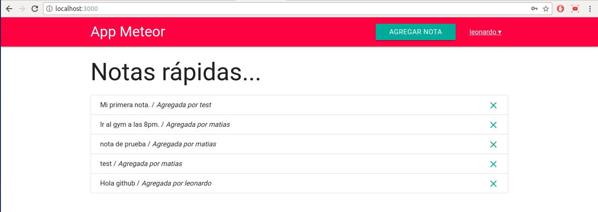

Fast Notes
=============



**Spanish** / English

Hola, mi nombre es Matías Vilches ([matiasvilches](https://github.com/matiasvilches) en github) y les quiero compartir este proyecto que realicé paso a paso siguiendo un tutorial en Youtube.

El tutorial se llama "Build A Meteor.js App In 45 Minutes". Se trabaja con JavaScript y Meteor, se crea una aplicación web donde puedes administrar tus Notas.

Link del tutorial: https://www.youtube.com/watch?v=9494-2E4riQ&t=1497s

Observación: Los textos del proyecto están en español, pero los nombres de las variables están en inglés.

Instalación:
------------
1. Clonar este repositorio con HTTPS.
	```
	git clone https://github.com/matiasvilches/fast-notes.git
	```

2. Entrar al directorio "fast-notes"
	```
	cd fast-notes
	```

3. Ingresar los siguientes comandos.
	```
	meteor update
	meteor npm install
	meteor npm install --save @babel/runtime
	meteor npm install --save bcrypt
	meteor
	```

4. Jugar con la aplicación web :)

---

Spanish / **English**

Hello, my name is Matías Vilches ([matiasvilches](https://github.com/matiasvilches) in github) and I want to share this project that I did step by step following a tutorial on YouTube.

The tutorial is called "Build A Meteor.js App In 45 Minutes". It works with JavaScript and Meteor, a web application is created where you can manage your Notes.

Link of the tutorial: https://www.youtube.com/watch?v=9494-2E4riQ&t=1497s

Note: The project texts are in Spanish, but the names of the variables are in English.

Installation:
------------
1. Clone this repository with HTTPS.
	```
	git clone https://github.com/matiasvilches/fast-notes.git
	```

2. Enter the directory "fast-notes"
	```
	cd fast-notes
	```

3. Execute the following commands.
	```
	meteor update
	meteor npm install
	meteor npm install --save @babel/runtime
	meteor npm install --save bcrypt
	meteor
	```

4. Play with the web application :)
